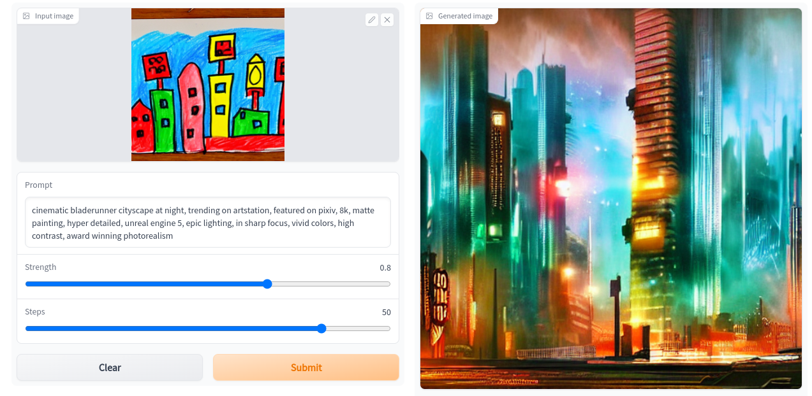

# Stable Diffusion
This app is a demo of the img2img feature in [Stable Diffusion](https://github.com/CompVis/stable-diffusion).

### Usage

1. Install requirements

```
pip install -r requirements
```

2. Run

```
lightning run app app.py
```

3. Transform images

On the Web UI, pick an example image and click on "Submit". The input image can be edited by clicking on the pencil icon.





### Acknowledgements

- The code for running stable diffusion on a CPU is adapted from [stable_diffusion.openvino](https://github.com/bes-dev/stable_diffusion.openvino) by [Sergei Belousov](https://github.com/bes-dev).
